# Proof of Concept - gRPC-based MACH Architecture TCO Costs Calculator
gRPC-based MACH Microservice TCO Costs Calculator based on Protocol Buffer definitions and the AWS Pricing API.

⚠️ **Disclaimer: Student Project / For Local Testing Only**
This repository contains a project developed during my time as a student. It is intended **strictly for educational and local testing purposes** and is **not production-ready**. 

### 🔧 Important Security & Configuration Notes
* **Do not use in production:** The architecture, dependencies, and configurations have not been audited for production environments.

This service calculates the TCO costs for a gRPC-based Microservices MACH Architecture's service by using the Protocol Buffers definition of the service.
Collaboration with AI Tools was performed for developing this project (check CREDITS.md file).
No license has been chosen to make this repository public, based on: https://docs.github.com/en/repositories/managing-your-repositorys-settings-and-features/customizing-your-repository/licensing-a-repository 

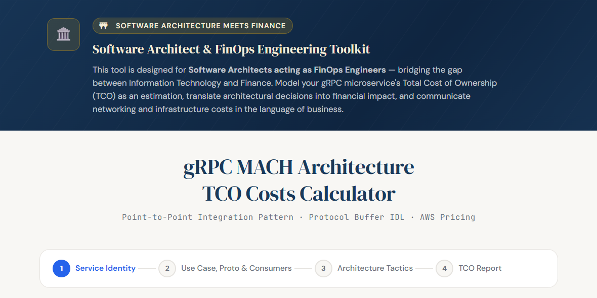

## Protocol Buffer files:
You can find the **Protocol Buffers files** in the [protos](src/main/resources/static/protos) folder, each of which is related to the [Business Use Cases](src/main/resources/static/protos/)
in the context of an **E-Commerce microservice**:
1. **BUC1**: **gRPC Unary pattern**: Retrieve orders by using an order ID from client to server.
2. **BUC2**: **gRPC Server Streaming pattern**: The business needs to retrieve all possible orders that match a search criterion (term or filter).
3. **BUC3**: **gRPC Client Streaming pattern**: Update a set of orders.
4. **BUC4**: **gRPC Bi-Directional Streaming pattern**: Send  a continuous set of orders and process them into combined shipments based on the delivery date.

## Application Profiles:
The service can be parametrized before building it to use a Cloud Service Provider to calculate costs. AWS is the only one supported so far. It is expected to cover another cloud service providers in the future.
**Application Profiles**: In order to provide Networking calculation costs and Cloud Costs the user should specify one of the three [ApplicationProfile.java](src/main/java/com/calculator/application/configuration/ApplicationProfile.java) for it before deploying the service: **aws (for Amazon Web Service)**, **azure (for Microsoft Azure)** or **gcp (for Google Cloud Platform)**.

## Constraints:
* **protoc dependency version supported**: **4.29.4** - used to load protocol buffer files and process them following the **protoc syntax v3**. Check [pom.xml](pom.xml)
* Java AWS SDK and **Java 21**
* **Spring Boot 3.2**
* **TCO Networking Cost calculation** considers only **costs for Data Transfer OUT From Amazon EC2 To Internet**.
* In [application.properties](src/main/resources/application.properties): To define the [Data Transfer OUT From Amazon EC2 To Internet](https://aws.amazon.com/ec2/pricing/on-demand/) get the values from **First 10 TB / Month** to **Greater than 150 TB / Month**.
* AWS_STANDARD_TIER_THRESHOLD_LIMITS_IN_GB are defined based on the ones defined in [Amazon EC2 On-Demand Pricing](https://aws.amazon.com/ec2/pricing/on-demand/).
* AWS tier thresholds and rates are correct for a **gRPC/EC2 workload in US East (N. Virginia)**.
* Define a global max repeated items in protofile like the maximum amount of messages property name: *protofile.max.repeated.items*.
* An **AWS account** with an **IAM user** with **permissions for consuming the AWS Pricing API** is needed.
* **Reliability tactics**: Client-side and server-side load balancing.
* **Resiliency tactics and patters**: Timeout, Retry and Circuit breaker.
* **Security tactics**: TLS Certificate and OAuth2.0 + JWT Token. 
* **Software Design Patterns that have been implemented**: **Composed Method** and **Builder**. Check for `// DESIGN PATTERN` comments.
* **NOTE**:Some tests might be skipped as those are operating system dependent (Windows, Linux or Mac OS).
* **Application Profiles**: Only **aws** is enabled and supported so far. It is expected to cover another cloud service providers in future versions.

## Software Architecture - C4 Model

### Context:
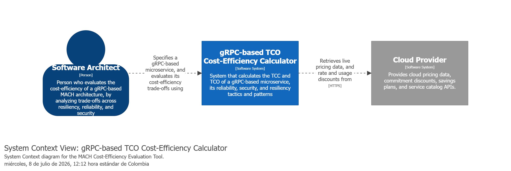

### Containers:
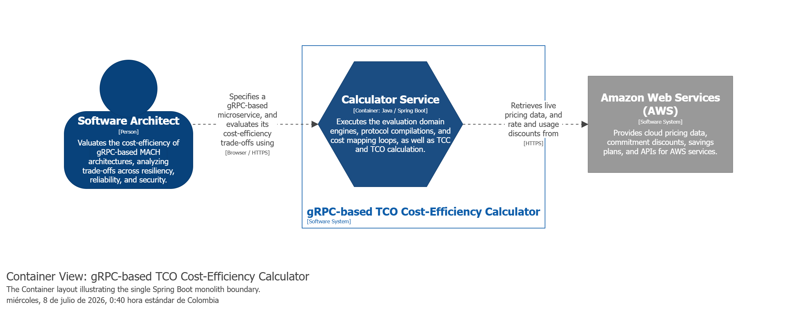

### Components:
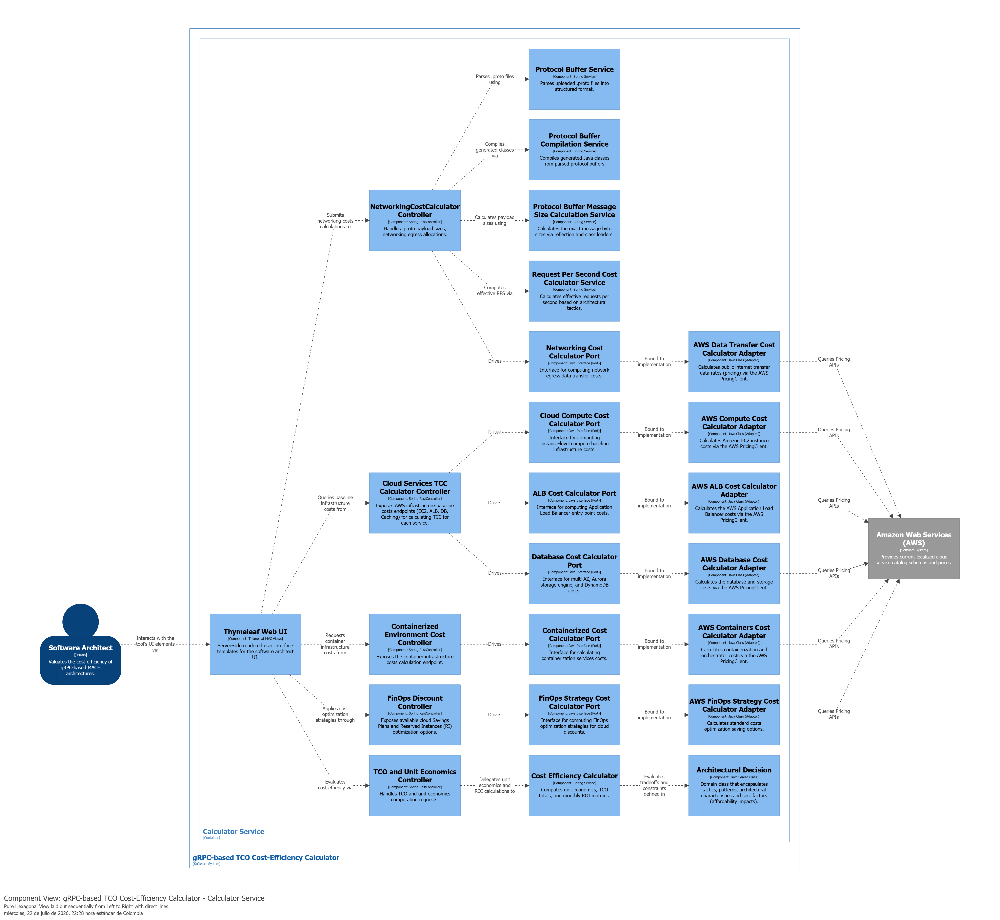

### MVC Controllers

| Controller Class Name                    | Request Method & Endpoint Path           | Replaces JS function / Description |
|------------------------------------------|------------------------------------------|---|
| `NetworkingCostCalculatorController`     | `POST /calculateProtofileNetworkingCosts`| `recalculateRps()`, and compiles `.proto` file uploads dynamically |
| `ContainerizedEnvironmentCostController` | `GET /api/cloud/container-pricing`       | Fetches live container pricing on-demand/fallback definitions from the cloud provider |
| `CloudServicesTCCCalculatorController`           | `GET /api/cloud/alb-pricing`             | Provides base structural load balancer tier schemas |
| `CloudServicesTCCCalculatorController`           | `GET /api/cloud/database-backup-pricing` | `recalculateDbCost()` (Backup and storage pricing frameworks) |
| `CloudServicesTCCCalculatorController`           | `GET /api/cloud/security-services`       | `recalculateSecCost()` (Native AWS protection parameters) |
| `CloudServicesTCCCalculatorController`           | `GET /api/cloud/cost-optimisation`       | `recalculateCostOpt()` (FinOps tactic strategies metadata) |
| `CloudServicesTCCCalculatorController`           | `GET /api/cloud/caching-pricing`         | `recalculateCaching()` (Cache tier sizing matrices) |
| `EffectiveRPSCalculatorController`       | `POST /api/tco/effective-rps`            | `recalculateRps()` (Network overhead scaling limits evaluation) |
| `FinOpsDiscountController`               | `POST /api/finops/ri-prices/{instanceType}`   | `getRiPrices()` (Reserved Instances options and pricing for the specified instance) |
| `PortfolioUnitEconomicsController`       | `POST /api/portfolio/roi`                | `calculatePortfolioRoi()` (Evaluates MACH Portfolio ROI) |
| `TCOUnitEconomicsController`             | `POST /api/cost/unit-economics`          | `calculateUnitEconomics()` (Calculates unit economics) |
| `ReliabilityTacticsController`           | `GET /api/reliability/tactic-mappings`   | Lists reliability tactics |
| `ResiliencyPatternsController`           | `GET /api/resiliency/tactic-mappings`    | Lists resiliency patterns |
| `SecurityTacticsController`              | `GET /api/security/tactic-mappings`      | Lists security tactics |
| `TacticsTCCContributionController`          | `POST /api/cost/tactic-contributions`    | Quantifies individual egress additions induced by architectural design decisions |
| `TacticsSessionController`               | `POST /api/session/tactics`              | Saves active architectural decisions into context state |
| `TacticsSessionController`               | `GET /api/session/tactics`               | Retrieves current architectural choices from session buffer |
| `TacticsSessionController`               | `DELETE /api/session/tactics`            | Purges tracked tactical options from the contextual storage |

### Ports & Adapters (Hexagonal Architecture)

This application leverages the Hexagonal Architecture pattern to decouple core business logic from cloud infrastructure providers. The table below outlines how the core domain ports map to specific AWS infrastructure adapters and their external pricing API interactions.

| Core Domain Port (`com.calculator.application.services.calculators.cost.cloud.ports.*`) | Infrastructure Adapter (`com.calculator.infrastructure.cloud.adapters.aws.*`) | External API Dependent / Client |
| :--- | :--- | :--- |
| `NetworkingCostCalculatorPort` | `AWSDataTransferCostCalculationServiceAdapter` | `PricingClient` (AWS Pricing API via `us-east-1`) |
| `CloudComputeCostCalculatorPort` | `AWSComputeCostCalculatorAdapter` | `PricingClient` (AWS Pricing API via `us-east-1`) |
| `ALBCostCalculatorPort` | `AWSALBCostCalculatorAdapter` | `PricingClient` (AWS Pricing API via `us-east-1`) & Local DB Repository |
| `DatabaseCostCalculatorPort` | `AWSDatabaseCostCalculatorAdapter` | `PricingClient` (AWS Pricing API via `us-east-1`) |
| `SecurityCostCalculatorPort` | `AWSSecurityCostCalculatorAdapter` | `PricingClient` (AWS Pricing API via `us-east-1`) & `AWSSecurityWAFCostCalculator` |
| `FinOpsStrategyCostCalculatorPort` | `AWSFinOpsStrategyCostCalculatorAdapter` | `PricingClient` (AWS Pricing API via `us-east-1`) |
| `CachingCostCalculatorPort` | `AWSCachingCostCalculatorAdapter` | `PricingClient` (AWS Pricing API via `us-east-1`) |
| `ContainerizedCostCalculatorPort` | `AWSContainersCostCalculatorAdapter` | `PricingClient` (AWS Pricing API via `us-east-1`) |

### Key Infrastructure Notes
* **AWS Pricing API Constraint**: The `PricingClient` bean is explicitly pinned to the `Region.US_EAST_1` endpoint, as it serves as the global endpoint for AWS Price List Service API queries.
* **Timeout Policies**: Inter-adapter calls to the AWS Pricing API are guarded with a strict timeout policy of a **4-second** attempt limit and a maximum **10-second** total call duration.

## AWS APIs for pricing - JSON responses:

- **Terminology**:
    - **SKU (Stock Keeping Unit)** is a unique, system-generated alphanumeric code that identifies a specific cloud resource, in a specific region, under a precise pricing model.
        - An SKU is not generic. A single AWS service (like Amazon GuardDuty) has hundreds of different SKUs because AWS generates a unique code for every variable, including:The Service: (e.g., Amazon GuardDuty vs. Amazon Macie)The Region: (e.g., US East (N. Virginia) vs. Europe (Frankfurt))The Specific Feature/Operation: (e.g., GuardDuty analyzing VPC Flow Logs vs. GuardDuty analyzing CloudTrail Logs).
- **Note**: in the AWSFinOpsStrategyCostCalculator class, the **t3.medium** has been used as a **BENCHMARK_INSTANCE_TYPE** as it is considered **the general purpose instance**:
    - [Instance types t3.medium EC2](https://aws.amazon.com/ec2/instance-types/t3/)
    - [EC2 Latest instance types](https://docs.aws.amazon.com/ec2/latest/instancetypes/gp.html)

- **AWS Price List Query API**:
    - ELB / ALB pricing: [alb-pricing.json](src/docs/awspricelistapiexamples/aws-alb-pricing.json)
    - RDS database pricing: [RDS-database-pricing.json](src/docs/awspricelistapiexamples/aws-rds-database-pricing.json)
    - FinOps CostOptimization Reserved Instances response: [ReservedInstances-finops-strategies-pricing.json](src/docs/awspricelistapiexamples/aws-reserved-instances-finops-strategies-pricing.json)
    - S3 database pricing: [S3-database-pricing.json](src/docs/awspricelistapiexamples/aws-s3-database-pricing.json)
    - Amazon GuardDuty: [amazon-guard-duty-pricing.json](src/docs/awspricelistapiexamples/amazon-guard-duty-pricing.json)
    - Amazon Inspector: [amazon-inspector.json](src/docs/awspricelistapiexamples/amazon-inspector.json)
    - Amazon Web Application Firewall:
        - Per rule pricing: [aws-waf-rule-pricing.json](src/docs/awspricelistapiexamples/aws-waf-rule-pricing.json)
        - Per billion requests pricing: [aws-waf-requests-pricing.json](src/docs/awspricelistapiexamples/aws-waf-requests-pricing.json)
    - Amazon Macie: [aws-macie-macie.json](src/docs/awspricelistapiexamples/aws-macie-macie.json)
    - Amazon CloudWatch: [aws-cloud-watch-pricing.json](src/docs/awspricelistapiexamples/aws-cloud-watch-pricing.json)
    - AWS KMS: [aws-kms-pricing.json](src/docs/awspricelistapiexamples/aws-kms-pricing.json)
    - AWS DataTransfer pricing: [aws-datatransfer-pricing.json](src/docs/awspricelistapiexamples/awsdatatransferpricingexamples/aws-datatransfer-pricing.json)
    - AWS Aurora MySQL: [aws-aurora-mysql-pricing.json](src/docs/awspricelistapiexamples/aws-aurora-mysql-pricing.json)
    - AWS EKS: [aws-eks-pricing.json](src/docs/awspricelistapiexamples/aws-eks-pricing.json)

- **AWS Price List Bulk API**:
    - PriceList Bulk response: [pricelist-bul-api.json](src/docs/awspricelistbulkapiexamples/aws-pricelist-bulk-api.json)
    - FinOps strategies pricing: [finops-strategies-pricing.json](src/docs/awspricelistbulkapiexamples/aws-finops-strategies-pricing.json)
    - Compute savings plans file response: [computesavingsplans-jsonpricingfile-response.json](src/docs/awspricelistbulkapiexamples/aws-computesavingsplans-jsonpricingfile-response.json)

## Fallback pricing values per services to fill cost factors:

### Fallback pricing for security services:

| Cloud Service | Cost Factor / Key Mapping | Fallback Value                                           | AWS Pricing Reference |
| :--- | :--- |:---------------------------------------------------------| :--- |
| **AWS KMS** | `kmsCmkPerMonth` `kmsApiCallsPer10k` | `$1.00` per CMK / month `$0.03` per 10,000 requests   | [AWS KMS Pricing](https://aws.amazon.com/kms/pricing/) |
| **AWS Audit Manager** | `auditManagerPerAssessmentMonth` | `$1.25` per 1,000 resource assessments                   | [AWS Audit Manager Pricing](https://aws.amazon.com/audit-manager/pricing/) |
| **Amazon CloudWatch** | `cloudwatchLogsIngestionPerGb` `cloudwatchLogsStoragePricePerGbMonth` | `$0.50` per GB ingestion `$0.03` per GB-month storage | [Amazon CloudWatch Pricing](https://aws.amazon.com/cloudwatch/pricing/) |
| **Amazon Macie** | `maciePerGbClassified` `macieFirstGbFreeNote` | `$1.00` per GB (First 1 GB free)                         | [Amazon Macie Pricing](https://aws.amazon.com/macie/pricing/) |
| **Amazon Inspector** | `inspectorPerInstanceMonth` | `$1.2528` per EC2 instance / month                       | [Amazon Inspector Pricing](https://aws.amazon.com/inspector/pricing/) |
| **Amazon GuardDuty** | `guardDutyPerGbLogs` `guardDutyFirstGbFreeNote` | `$1.00` per GB (First 500 GB free)                       | [Amazon GuardDuty Pricing](https://aws.amazon.com/guardduty/pricing/) |

## Design principles

- Frontend sends and project **raw inputs and outputs** (form values) + **pricing data** (already fetched from `/api/cloud/*`) to and from each endpoint.
- Backend returns **computed results** only — costs, breakdowns, labels.

## Retry formula (preserved)
`patternRetryTimes = baseRps × (errorPct / 100)` — always uses BASE RPS.

## 🏛️ Unit Economics & TCO formulas

The following table outlines the mathematical formulations used by the TCO Networking Costs Calculator to determine economic viability, compared against two distinct operational scenarios (ARPU = $15.00).

| Metric | Mathematical Formula | Scenario 1 (Optimized) | Scenario 2 (Unoptimized) |
| :--- | :--- | :--- | :--- |
| **RPS** | System Load | 1,000 | 1,050 |
| **Consumers** | Paying Tenants | 350 | 350 |
| **ARPU** | Revenue Per User | $15.00 | $15.00 |
| **Total Monthly TCO** | $Egress + Cloud$ | $2,592.00 | $5,443.20 |
| **Monthly Requests** | $RPS \times 2.592M$ | 2,592,000,000 | 2,721,600,000 |
| **Cost per Request** | $TCO / Requests$ | $0.000001 | $0.000002 |
| **Cost per User/Mo** | $TCO / Consumers$ | $7.4057 | $15.5520 |
| **Cost per User/Day** | $CostPerUser / 30$ | $0.2469 | $0.5184 |
| **Monthly Revenue** | $Consumers \times ARPU$ | $5,250.00 | $5,250.00 |
| **Net Monthly Profit** | $Rev - TCO$ | +$2,658.00 | -$193.20 |
| **Monthly ROI %** | $(Profit / TCO) \times 100$ | +102.55% | -3.55% |
| **Break-Even Users** | $\lceil TCO / ARPU \rceil$ | 173 | 363 |
| **Net Margin/User** | $ARPU - CostPerUser$ | +$7.5943 | -$0.5520 |

## How to run it?
1. Execute ``mvn clean install -e`` from your terminal in order to generate the gRPCTCONetworkingCostCalculator **jar file**.
2. Execute ``aws login`` in your terminal. That will redirect you to your AWS logged account to get the **AWS SDK authenticated**.
3. Execute in your terminal ``java -jar target\gRPCTCONetworkingCostCalculator-1.0-SNAPSHOT.jar``
4. In your browser go to [Service URL](http://localhost:8080/).
5. To interact with the functionalities you must take into account the FinOps-gRPC End2End Model Interaction Process described below.

### Identity of the service:

### Select the use case, upload Protofile and define Consumers:
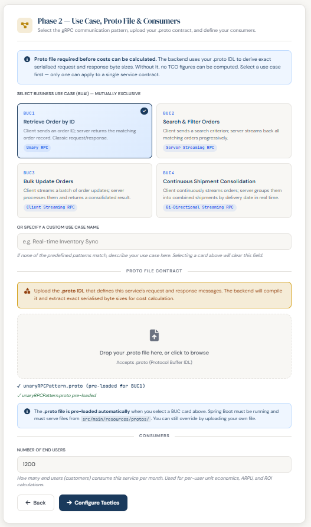

### End2End Model Interaction Process

#### Choose a Quality Attribute & Choose Tactics to Promote Quality Attribute

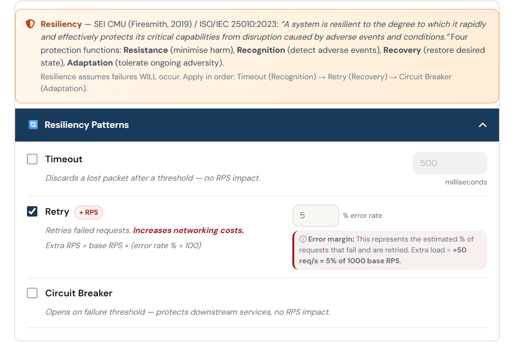

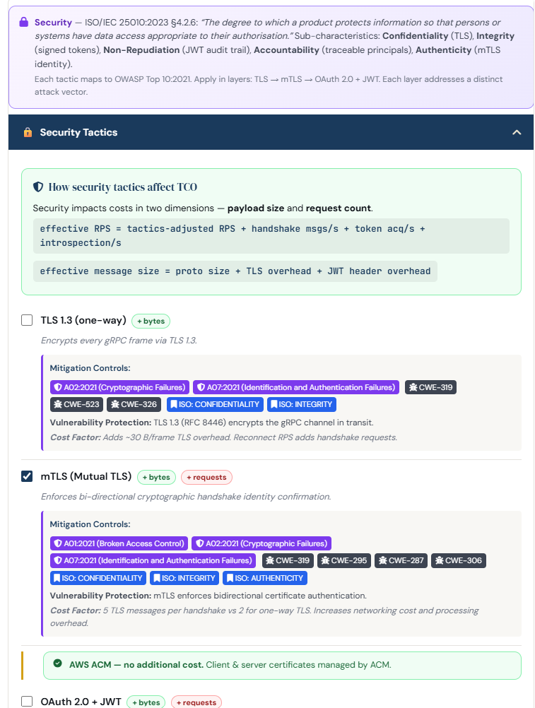

#### Map Cloud Services to Implement those tactics:
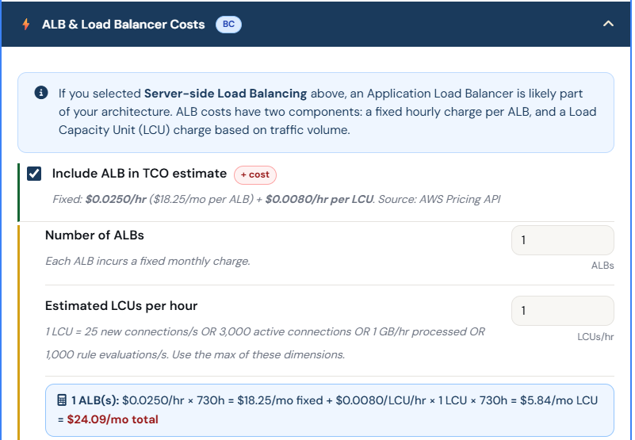

#### Calculate Base Costs:
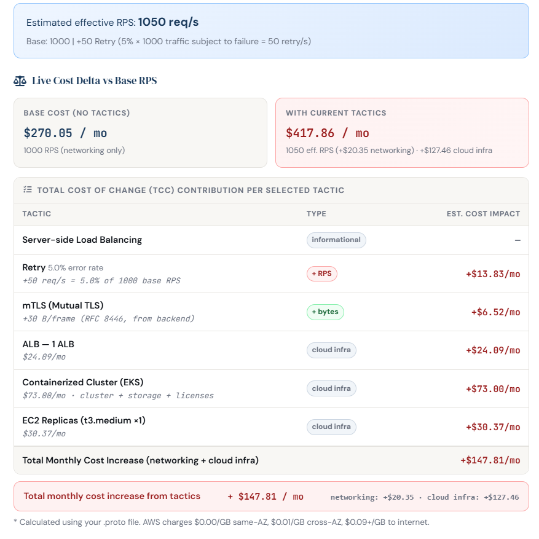

#### Define costs optimization strategies (FinOps practices)
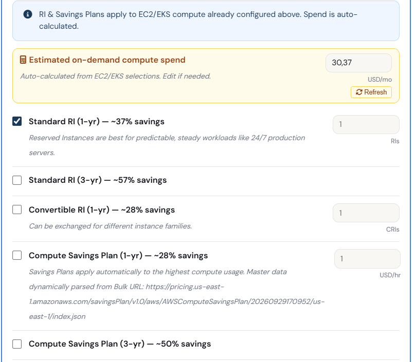

#### Calculate the new cost (TCO Costs) and Unit Economics:

#### Unit Economics and cost-efficiency

#### Discernment with FinOps Personas and Engineering Teams:

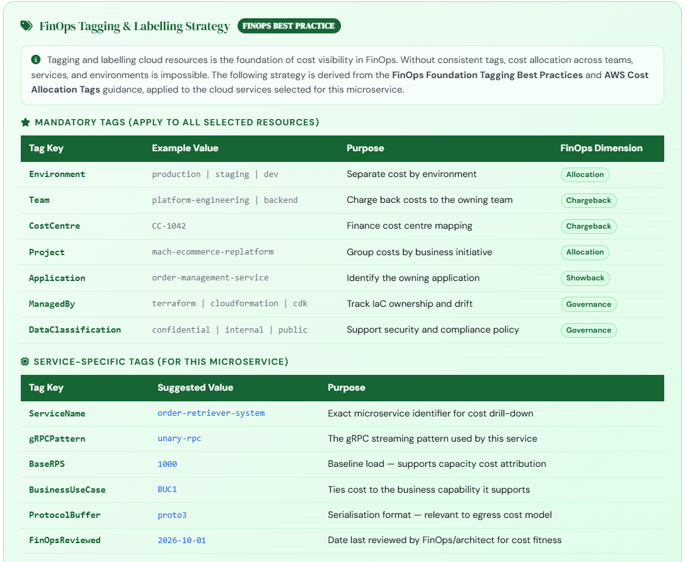

# Notes on containerized costs:
## EKS Cost Breakdown

### Overview

The total cost of running an Amazon EKS cluster consists of two distinct components:

1. **EKS Control Plane Fee** – A fixed charge for managing the Kubernetes control plane.
2. **EC2 Worker Nodes** – The compute cost for the instances running your workloads.

These charges are **not duplicated**; they represent separate AWS services.

### Cost Components

| Component | Pricing | Approx. Monthly Cost   |
|-----------|---------|------------------------|
| **EKS Control Plane** | $0.10/hour per cluster | ~$73/month             |
| **EC2 Worker Nodes** (e.g., t3.medium) | $0.0416/hour per instance (us-east-1) | ~$30.37/month per node |

### Key Points

- The **$73/month** charge is **only** for the EKS control plane.
- **EC2 worker nodes** (e.g., t3.medium) are billed **separately** as standard EC2 instances.
- **Reserved Instances (RI)** or **Compute Savings Plans** apply **only to the EC2 worker node costs**, not the EKS control plane fee.
- Therefore, a FinOps RI discount is applied to the **total EC2 worker node cost** (e.g., $30.37), not to the control plane charge.

### Example Monthly Cost (1 cluster + 1 t3.medium node)

- **EKS Control Plane**: ~$73
- **1× t3.medium (On-Demand)**: ~$30.37
- **Total**: ~$103.37/month (before RI/SP discounts)

## How FinOps principles were applied?
1. **Teams Need to Collaborate**: this is a tool that enables engineering teams leaded by a software architect to consider cost-efficiency as an architectural characteristic to be aligned with Finance teams.
2. **Decisions are driven by the business value of cloud**: the tool calculates an estimation of the ROI of implementing the architecture or the MACH portfolio on cloud.
3. **Everyone takes ownership of their cloud usage**: in this tool the ownership of cloud usage is envisioned to software architects and their engineering teams.
4. **FinOps reports should be accessible and timely**: this tool generates a unit economics report in phase 5 immediately after software architect selects the software tactics and patterns. Includes also suggestions for cost allocation for each microservice.
5. **A centralized team drives FinOps**: this tools enables centralized teams to suggest this 5 phase process to engineering teams to include cost-efficiency an architectural characteristic as part of the analysis and architectural design processes.
6. **Take advantage of the variable cost model of the cloud**: this tool includes different FinOps strategies to apply and the costs directly from the cloud vendors API (so far AWS the only one supported).

# References:
1. [Protocol Buffers overview](https://protobuf.dev/overview/).
2. [Data Transfer OUT From Amazon EC2 To Internet](https://aws.amazon.com/ec2/pricing/on-demand/).
3. [ArchUnit for Architectural Tests](https://www.archunit.org/userguide/html/000_Index.html).
4. [RFC 9113 - HTTP/2 and TLS 1.2 or higher](https://www.rfc-editor.org/rfc/rfc9113.html#TLSUsage).
5. [RFC 8446 - TLS 1.3](https://www.rfc-editor.org/rfc/rfc8446.html).
6. [RFC 5116 - Authenticated Encryption with Associated Data](https://www.rfc-editor.org/rfc/rfc5116).
7. [RFC 7519 - JSON Web Token (JWT) Overview](https://www.rfc-editor.org/rfc/rfc7519.html#section-3).
8. [RFC 9101 - The OAuth 2.0 Authorization Framework: JWT-Secured Authorization Request (JAR)](https://www.rfc-editor.org/rfc/rfc9101).
9. [ISO/IEC 25012 - Data Quality model](https://iso25000.com/index.php/en/iso-25000-standards/iso-25012/136-iso-iec-2012#:~:text=System%2DDependent%20Data%20Quality:%20System,migration%20tools%20to%20achieve%20portability).
10. [Richardson, C. (2019). Microservices Patterns. MANNING.](https://learning.oreilly.com/library/view/microservices-patterns/9781617294549/).
11. [Design Patterns: Elements of Reusable Object-Oriented Software](https://a.co/d/b77puMG).
12. [Refactoring to Patterns](https://a.co/d/0faJEZSx).
13. [gRPC: Up and Running: Building Cloud Native Applications with Go and Java for Docker and Kubernetes](https://a.co/d/0cr8VGEU).
14. [gRPC Microservices in Go](https://a.co/d/00mpZLip).
15. [Mach Architecture: Microservices, API-first, Cloud-native, and Headless principles](https://a.co/d/0aqCTQKt).
16. [Cloud FinOps, 2nd Edition: Collaborative, Real-Time Cloud Value Decision Making](https://a.co/d/0f8kkjcU).
17. [Migrating to AWS: A Manager's Guide: How to Foster Agility, Reduce Costs, and Bring a Competitive Edge to Your Business](https://a.co/d/0bCjXIW5).
18. [Building Microservices, 2nd Edition](https://www.oreilly.com/library/view/building-microservices-2nd/9781492034018/).
19. [Monolith to Microservices](https://www.oreilly.com/library/view/monolith-to-microservices/9781492047834/).
20. [Communication Patterns](https://www.oreilly.com/library/view/communication-patterns/9781098140533/).
21. [UML for Java Programmers](https://www.oreilly.com/library/view/uml-for-javatm/0131428489/).
22. [AWS FinOps Simplified](https://www.oreilly.com/library/view/aws-finops-simplified/9781803247236/).
23. [Engineering Resilient Systems on AWS](https://www.oreilly.com/library/view/engineering-resilient-systems/9781098162412/).
24. [Building Resilient Architectures on AWS](https://www.oreilly.com/library/view/building-resilient-architectures/9781835887103/).
25. [System Design on AWS](https://www.oreilly.com/library/view/system-design-on/9781098146887/).
26. [Efficient Cloud FinOps](https://www.oreilly.com/library/view/efficient-cloud-finops/9781805122579/).
27. [AWS Certified Solutions Architect](https://www.oreilly.com/library/view/aws-certified-solutions/9781119982623/).
28. [AWS EKS Pricing](https://aws.amazon.com/eks/pricing/)
29. [EKS Pricing: A Complete Breakdown (2025 Guide)](https://www.devzero.io/blog/eks-pricing)
30. [AWS EKS Cluster Pricing - StackSimplify](https://docs.stacksimplify.com/aws-eks/eks-cluster/eks-cluster-pricing/)

## Credits
[CREDITS.md](CREDITS.md)

## Master's Thesis

This repository contains the software implementation developed in support of the author's Master's Thesis.
**Thesis: End-to-end model to apply FinOps for Evaluating Cost Efficiency of gRPC-based MACH Architectures: Resiliency, Reliability, and Security Trade-offs.**
**Author**: William Martín Chávez González.
This project was developed within a university Master's Degree project for educational purposes of validating a proposed model with a Proof of Concept. 
**No license is granted** to any individual or entity to copy, distribute, modify, sub-license, or use this software (or any part of its architectural framework) for commercial, corporate, or non-academic purposes.

### 🎓 Academic & AI Collaboration Statement
*(As stated in the accompanying Master's Thesis document)*:

> "Along with the use of AI  tools like Claude Code and Google Gemini, I developed and modeled the software architecture views effectively and efficiently by addressing all the concerns and architectural drivers and guiding  the AI in the details of my implementation."
>
> "Even though I relied on the help of Claude Code (Anthropic, 2026), Gemini, and Perplexity AI as tools to guide the development and validate the  cost-efficiency calculator for Software Architects, the difficulty of refactoring, validating, and testing  against the model to ensure consistency with the FinOps, MACH, and AWS mapping was extremely  challenging; it was also entertaining and enriching."

## Disclaimer & Usage Terms
Based on:https://docs.github.com/en/repositories/managing-your-repositorys-settings-and-features/customizing-your-repository/licensing-a-repository 
"You're under no obligation to choose a license. However, without a license, the default copyright laws apply, meaning that you retain all rights to your source code and no one may reproduce, distribute, or create derivative works from your work. If you're creating an open source project, we strongly encourage you to include an open source license".
Therefore no license has been chosen to make this repository public.

1. AI-Assisted Content & Copyright Notice: This repository contains a technical synthesis developed with the assistance of Artificial Intelligence (AI) tools. To the maximum extent permitted by applicable copyright laws, the human creator claims exclusive rights over the original synthesis, architecture, and technical verification of this codebase.
2. No Warranty & Limitation of Liability: This code is provided "as-is" for educational and informational purposes only. Since AI tools were utilized in its generation, the author cannot guarantee that the codebase is completely free of third-party intellectual property overlaps. The author disclaims any liability for copyright infringements, bugs, or damages arising from the use of this software.
3. GitHub Alignment & Local Testing License: In compliance with GitHub's Terms of Service, users are granted the right to view and fork this repository within the Service. Additionally, as it is defined by GitHub "Some projects include information about their license in their README"(https://docs.github.com/en/repositories/managing-your-repositorys-settings-and-features/customizing-your-repository/licensing-a-repository), the author grants a limited, non-exclusive, and non-transferable license to clone and download this repository solely for personal, local testing and evaluation purposes. **No license is granted** to any individual or entity to copy, distribute, modify, sub-license, or use this software (or any part of its architectural framework) for commercial, corporate, or non-academic purposes. Any modification, external redistribution, or commercial exploitation is strictly prohibited.
