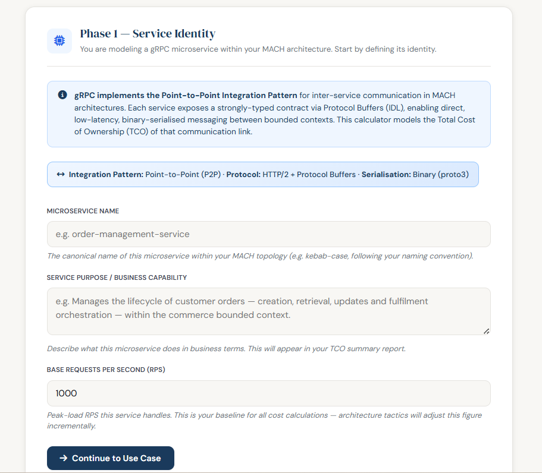
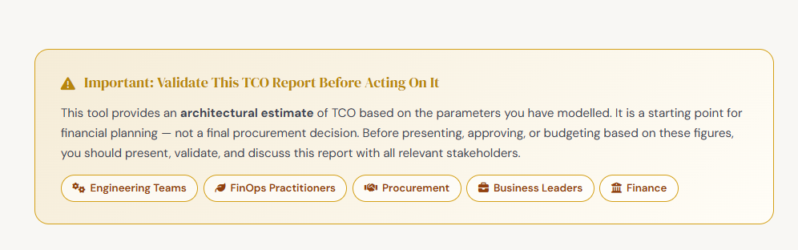
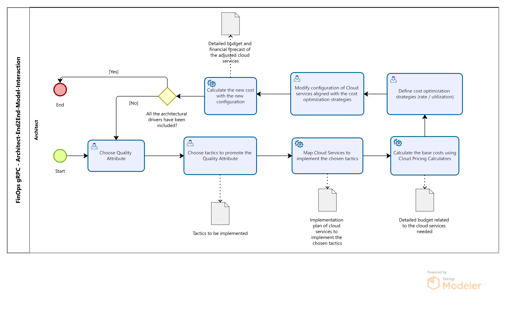
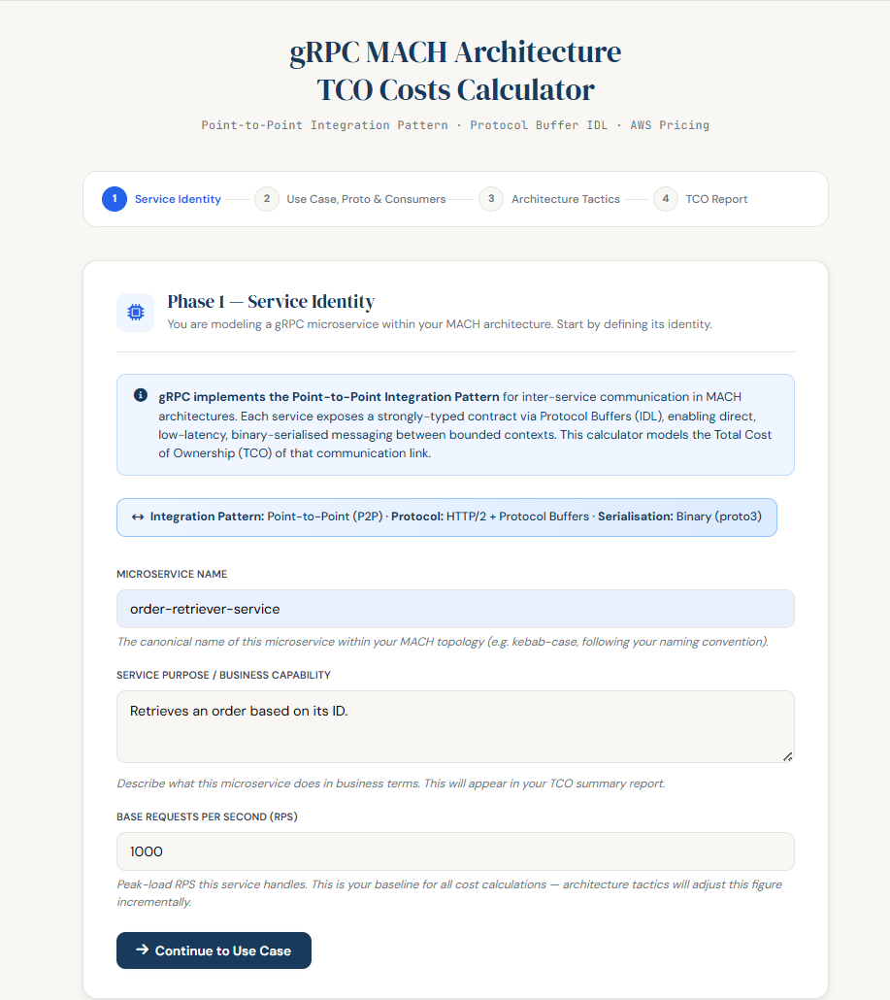
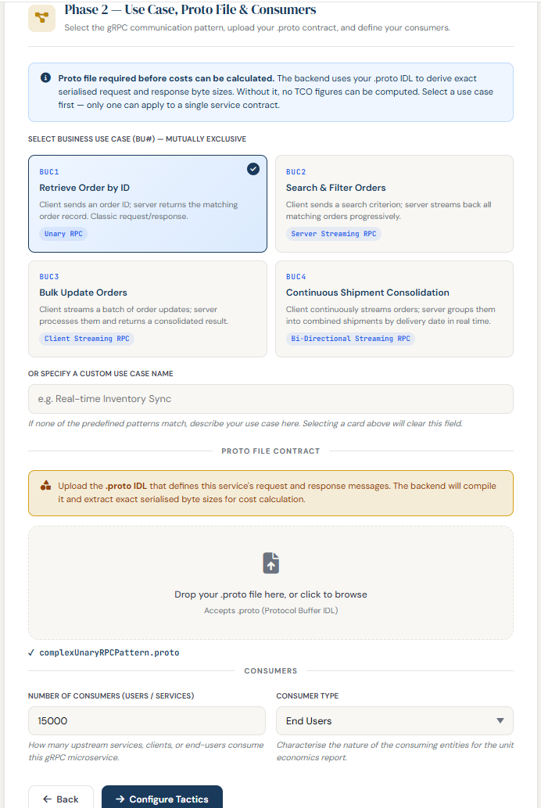
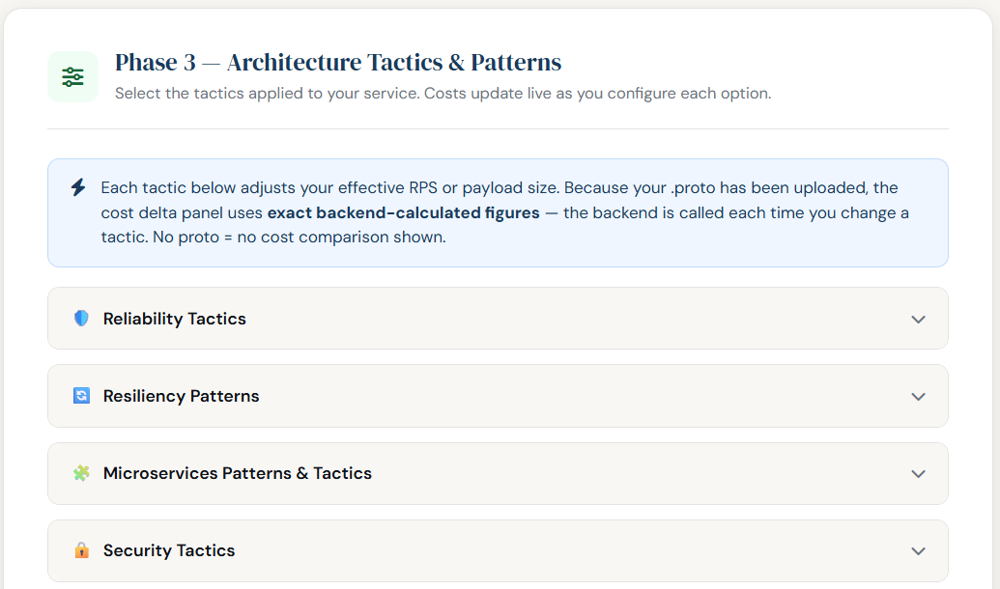
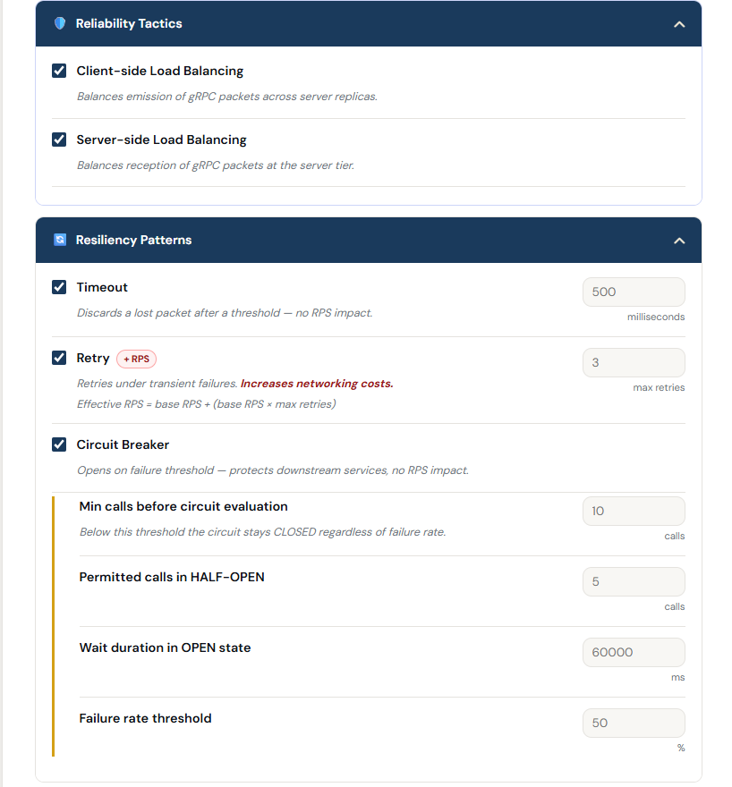
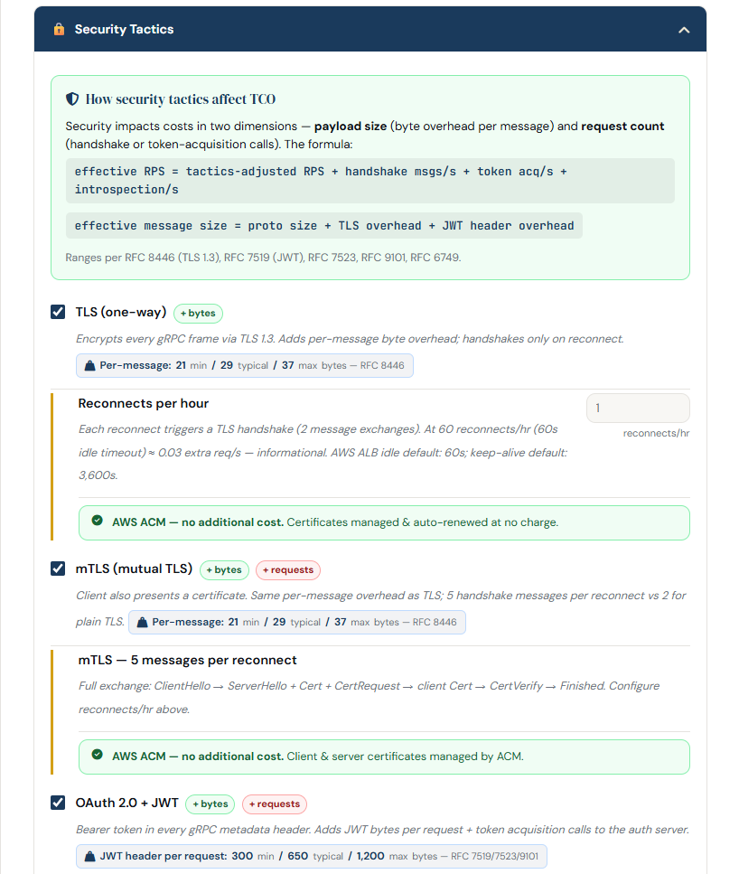
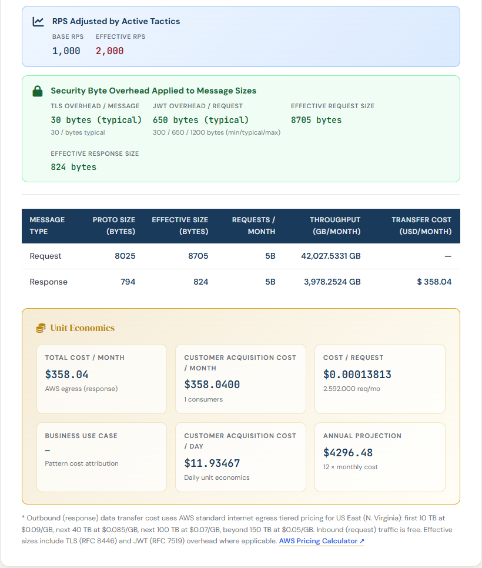

# gRPC-based MACH Architecture TCO Costs Calculator
gRPC-based MACH Microservice TCO Costs Calculator based on Protocol Buffer definitions and the AWS Pricing API.

This service calculates the TCO costs for a gRPC-based Microservices MACH Architecture's service by using the Protocol Buffers definition of the service.

## Protocol Buffer files:
You can find the **Protocol Buffers files** in the [protos](src/main/resources/static/protos) folder, each of which is related to the [Business Use Cases](src/main/resources/static/protos/)
in the context of an **E-Commerce microservice**:
1. **BUC1**: **gRPC Unary pattern**: Retrieve orders by using an order ID from client to server.
2. **BUC2**: **gRPC Server Streaming pattern**: The business needs to retrieve all possible orders that match a search criterion (term or filter).
3. **BUC3**: **gRPC Client Streaming pattern**: Update a set of orders.
4. **BUC4**: **gRPC Bi-Directional Streaming pattern**: Send  a continuous set of orders and process them into combined shipments based on the delivery date.

## Application Profiles:
The service can be parametrized before building it to use a Cloud Service Provider to calculate costs.
**Application Profiles**: In order to provide Networking calculation costs and Cloud Costs the user should specify one of the three [ApplicationProfile.java](src/main/java/com/calculator/application/configuration/ApplicationProfile.java) for it before deploying the service: **aws (for Amazon Web Service)**, **azure (for Microsoft Azure)** or **gcp (for Google Cloud Platform)**.

## Constraints:
* **protoc dependency version supported**: **4.29.4** - used to load protocol buffer files and process them following the **protoc syntax v3**. Check [pom.xml](pom.xml)
* Java AWS SDK and **Java 21+**
* **Spring Boot 3.2+**
* **TCO Networking Cost calculation** considers only **costs for Data Transfer OUT From Amazon EC2 To Internet**.
* In [application.properties](src/main/resources/application.properties): To define the [Data Transfer OUT From Amazon EC2 To Internet](https://aws.amazon.com/ec2/pricing/on-demand/) get the values from **First 10 TB / Month** to **Greater than 150 TB / Month**.
* AWS_STANDARD_TIER_THRESHOLD_LIMITS_IN_GB are defined based on the ones defined in [Amazon EC2 On-Demand Pricing](https://aws.amazon.com/ec2/pricing/on-demand/).
* AWS tier thresholds and rates are correct for a **gRPC/EC2 workload in US East (N. Virginia)**.
* Define a global max repeated items in protofile like the maximum amount of messages property name: *protofile.max.repeated.items*.
* An **AWS account** with an **IAM user** with **permissions for consuming the AWS Pricing API** is needed.
* **Reliability tactics**: Client-side and server-side load balancing.
* **Resiliency tactics and patters**: Timeout, Retry and Circuit breaker.
* **Security tactics**: TLS Certificate and OAuth2.0 + JWT Token. 
* **Software Design Patterns that have been implemented**: **Composed Method** and **Builder**. Check for `// DESIGN PATTERN` comments.
* **NOTE**:Some tests might be skipped as those are operating system dependent.
* **Application Profiles**: Only **aws** is enabled.

## How to run it?
1. Execute ``mvn clean install -e`` from your terminal in order to generate the gRPCTCONetworkingCostCalculator **jar file**.
2. Execute ``aws login`` in your terminal. That will redirect you to your AWS logged account to get the **AWS SDK authenticated**.
3. Execute in your terminal ``java -jar target\gRPCTCONetworkingCostCalculator-1.0-SNAPSHOT.jar``
4. In your browser go to [Service URL](http://localhost:8080/).
5. To interact with the functionalities you must take into account the FinOps-gRPC End2End Model Interaction Process described below.

## FinOps - gRPC - End2End Model Interaction Process for Software Architects and FinOps Engineers

### Identity of the service:

### Select the use case, upload Protofile and define Consumers:

### End2End Model Interaction Process

#### Choose a Quality Attribute

#### Choose Tactics to Promote Quality Attribute

#### Map Cloud Services to Implement those tactics:

#### Calculate Base Costs:

#### Define costs optimization strategies (FinOps practices)}

#### Modify Configuration of Cloud Services based on FinOps practices
Pending

#### Calculate the new cost (TCO Costs) and Unit Economics:

### Discernment with FinOps Personas and Engineering Teams:

## MVC Controllers

| Controller Class Name | Request Method & Endpoint Path | Replaces JS function / Description |
|---|---|---|
| `TCOCalculatorController` | `POST /` | `recalculateRps()`, `calcMonthlyCost()`, and compiles `.proto` file uploads dynamically |
| `CloudServiceCostController` | `POST /api/cost/alb` | `recalculateAlb()` |
| `ContainerizedEnvironmentCostController` | `GET /api/aws/ec2-instances` | Fetches live compute node on-demand/fallback definitions |
| `CloudTCOCalculatorController` | `GET /api/aws/alb-pricing` | Provides base structural load balancer tier schemas |
| `CloudTCOCalculatorController` | `GET /api/aws/database-backup-pricing` | `recalculateDbCost()` (Backup and storage pricing frameworks) |
| `CloudTCOCalculatorController` | `GET /api/aws/security-services` | `recalculateSecCost()` (Native AWS protection parameters) |
| `CloudTCOCalculatorController` | `GET /api/aws/cost-optimisation` | `recalculateCostOpt()` (FinOps tactic strategies metadata) |
| `CloudTCOCalculatorController` | `GET /api/aws/caching-pricing` | `recalculateCaching()` (Cache tier sizing matrices) |
| `EffectiveRPSCalculatorController` | `POST /api/tco/effective-rps` | `recalculateRps()` (Network overhead scaling limits evaluation) |
| `FinOpsDiscountController` | `POST /api/finops/container-discounts` | `recalculateContainerCost()` (RI vs Savings Plans optimization rules) |
| `PortfolioROIController` | `POST /api/portfolio/roi` | `recalculateTimeline()` / `recalculateReplicas()` (Evaluates macro profit metrics across service bundles) |
| `UnitEconomicsController` | `POST /api/cost/unit-economics` | `populateUnitEcon()` (Compares request expenses against consumer ARPU constraints) |
| `ReliabilityTacticsController` | `GET /api/reliability/tactic-mappings` | Lists qualitative score matrices for streaming protocols |
| `ResiliencyPatternsController` | `GET /api/resiliency/tactic-mappings` | Lists resiliency structural tradeoff profiles |
| `SecurityTacticsController` | `GET /api/security/tactic-mappings` | Lists channel security tactic constraints profiles |
| `TacticsContributionController` | `POST /api/cost/tactic-contributions` | Quantifies individual egress additions induced by architectural design decisions |
| `TacticsSessionController` | `POST /api/session/tactics` | Saves active architectural decisions into context state |
| `TacticsSessionController` | `GET /api/session/tactics` | Retrieves current architectural choices from session buffer |
| `TacticsSessionController` | `DELETE /api/session/tactics` | Purges tracked tactical options from the contextual storage |

## AWS APIs for pricing - JSON responses:

- **Terminology**:
  - **SKU (Stock Keeping Unit)** is a unique, system-generated alphanumeric code that identifies a specific cloud resource, in a specific region, under a precise pricing model.
    - An SKU is not generic. A single AWS service (like Amazon GuardDuty) has hundreds of different SKUs because AWS generates a unique code for every variable, including:The Service: (e.g., Amazon GuardDuty vs. Amazon Macie)The Region: (e.g., US East (N. Virginia) vs. Europe (Frankfurt))The Specific Feature/Operation: (e.g., GuardDuty analyzing VPC Flow Logs vs. GuardDuty analyzing CloudTrail Logs)

- **AWS Price List Query API**: 
  - ELB / ALB pricing: [alb-pricing.json](src/main/resources/awspricelistapiexamples/aws-alb-pricing.json)
  - RDS database pricing: [RDS-database-pricing.json](src/main/resources/awspricelistapiexamples/aws-rds-database-pricing.json)
  - FinOps CostOptimization Reserved Instances response: [ReservedInstances-finops-strategies-pricing.json](src/main/resources/awspricelistapiexamples/aws-reserved-instances-finops-strategies-pricing.json)
  - S3 database pricing: [S3-database-pricing.json](src/main/resources/awspricelistapiexamples/aws-s3-database-pricing.json)
  - Amazon GuardDuty: [amazon-guard-duty-pricing.json](src/main/resources/awspricelistapiexamples/amazon-guard-duty-pricing.json)
  - Amazon Inspector: [amazon-inspector.json](src/main/resources/awspricelistapiexamples/amazon-inspector.json)
  - Amazon Web Application Firewall:
    - Per rule pricing: [aws-waf-rule-pricing.json](src/main/resources/awspricelistapiexamples/aws-waf-rule-pricing.json)
    - Per billion requests pricing: [aws-waf-requests-pricing.json](src/main/resources/awspricelistapiexamples/aws-waf-requests-pricing.json)
  - Amazon Macie: [aws-macie-macie.json](src/main/resources/awspricelistapiexamples/aws-macie-macie.json)
  - Amazon CloudWatch: [aws-cloud-watch-pricing.json](src/main/resources/awspricelistapiexamples/aws-cloud-watch-pricing.json)
  - AWS KMS: [aws-kms-pricing.json](src/main/resources/awspricelistapiexamples/aws-kms-pricing.json)
  - AWS DataTransfer pricing: [aws-datatransfer-pricing.json](src/main/resources/awspricelistapiexamples/awsdatatransferpricingexamples/aws-datatransfer-pricing.json)

- **AWS Price List Bulk API**:
  - PriceList Bulk response: [pricelist-bul-api.json](src/main/resources/awspricelistbulkapiexamples/aws-pricelist-bulk-api.json)
  - FinOps strategies pricing: [finops-strategies-pricing.json](src/main/resources/awspricelistbulkapiexamples/aws-finops-strategies-pricing.json)
  - Compute savings plans file response: [computesavingsplans-jsonpricingfile-response.json](src/main/resources/awspricelistbulkapiexamples/aws-computesavingsplans-jsonpricingfile-response.json)

## Design principle

- Frontend sends **raw inputs** (form values) + **pricing data** (already fetched from `/api/aws/*`) to each endpoint.
- Backend returns **computed results** only — costs, breakdowns, labels.
- No business logic in JS. JS = form collection + API call + render.

## Retry formula (preserved)
`tacticRetryTimes = baseRps × (errorPct / 100)` — always uses BASE RPS.

# References:
1. [Protocol Buffers overview](https://protobuf.dev/overview/).
2. [Data Transfer OUT From Amazon EC2 To Internet](https://aws.amazon.com/ec2/pricing/on-demand/).
3. [ArchUnit for Architectural Tests](https://www.archunit.org/userguide/html/000_Index.html).
4. [RFC 9113 - HTTP/2 and TLS 1.2 or higher](https://www.rfc-editor.org/rfc/rfc9113.html#TLSUsage).
5. [RFC 8446 - TLS 1.3](https://www.rfc-editor.org/rfc/rfc8446.html).
6. [RFC 5116 - Authenticated Encryption with Associated Data](https://www.rfc-editor.org/rfc/rfc5116).
7. [RFC 7519 - JSON Web Token (JWT) Overview](https://www.rfc-editor.org/rfc/rfc7519.html#section-3).
8. [RFC 9101 - The OAuth 2.0 Authorization Framework: JWT-Secured Authorization Request (JAR)](https://www.rfc-editor.org/rfc/rfc9101).
9. [ISO/IEC 25012 - Data Quality model](https://iso25000.com/index.php/en/iso-25000-standards/iso-25012/136-iso-iec-2012#:~:text=System%2DDependent%20Data%20Quality:%20System,migration%20tools%20to%20achieve%20portability).
10. [Richardson, C. (2019). Microservices Patterns. MANNING.](https://learning.oreilly.com/library/view/microservices-patterns/9781617294549/).
11. [Design Patterns: Elements of Reusable Object-Oriented Software](https://a.co/d/b77puMG).
12. [Refactoring to Patterns](https://a.co/d/0faJEZSx).
13. [gRPC: Up and Running: Building Cloud Native Applications with Go and Java for Docker and Kubernetes](https://a.co/d/0cr8VGEU).
14. [gRPC Microservices in Go](https://a.co/d/00mpZLip).
15. [Mach Architecture: Microservices, API-first, Cloud-native, and Headless principles](https://a.co/d/0aqCTQKt).
16. [Cloud FinOps, 2nd Edition: Collaborative, Real-Time Cloud Value Decision Making](https://a.co/d/0f8kkjcU).
17. [Migrating to AWS: A Manager's Guide: How to Foster Agility, Reduce Costs, and Bring a Competitive Edge to Your Business](https://a.co/d/0bCjXIW5).
18. [Building Microservices, 2nd Edition](https://www.oreilly.com/library/view/building-microservices-2nd/9781492034018/).
19. [Monolith to Microservices](https://www.oreilly.com/library/view/monolith-to-microservices/9781492047834/).
20. [Communication Patterns](https://www.oreilly.com/library/view/communication-patterns/9781098140533/).
21. [UML for Java Programmers](https://www.oreilly.com/library/view/uml-for-javatm/0131428489/).
22. [AWS FinOps Simplified](https://www.oreilly.com/library/view/aws-finops-simplified/9781803247236/).
23. [Engineering Resilient Systems on AWS](https://www.oreilly.com/library/view/engineering-resilient-systems/9781098162412/).
24. [Building Resilient Architectures on AWS](https://www.oreilly.com/library/view/building-resilient-architectures/9781835887103/).
25. [System Design on AWS](https://www.oreilly.com/library/view/system-design-on/9781098146887/).
26. [Efficient Cloud FinOps](https://www.oreilly.com/library/view/efficient-cloud-finops/9781805122579/).
27. [AWS Certified Solutions Architect](https://www.oreilly.com/library/view/aws-certified-solutions/9781119982623/).

## Credits
[CREDITS.md](CREDITS.md)